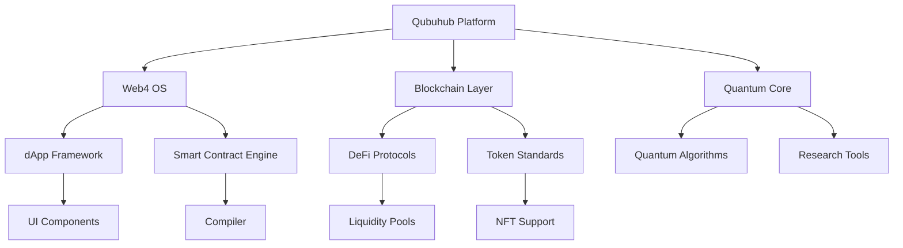

# Welcome to Qubuhub 👋

```
  ██████╗ ██╗   ██╗██████╗ ██╗   ██╗██╗  ██╗██╗   ██╗██████╗ 
 ██╔═══██╗██║   ██║██╔══██╗██║   ██║██║  ██║██║   ██║██╔══██╗
 ██║   ██║██║   ██║██████╔╝██║   ██║███████║██║   ██║██████╔╝
 ██║▄▄██║██║   ██║██╔══██╗██║   ██║██╔══██║██║   ██║██╔══██╗
 ╚██████╔╝╚██████╔╝██████╔╝╚██████╔╝██║  ██║╚██████╔╝██████╔╝
  ╚══▀▀═╝  ╚═════╝ ╚═════╝  ╚═════╝ ╚═╝  ╚═╝ ╚═════╝ ╚═════╝ 
```


## 🎯 About Us

Qubuhub is a cutting-edge organization dedicated to developing innovative blockchain solutions, quantum computing applications, and next-generation web technologies. We're passionate about pushing the boundaries of what's possible and fostering a collaborative community of developers, researchers, and innovators.


> **Our Mission:** Empowering developers with tools and frameworks that bridge traditional web development with decentralized technologies.

---

## 🚀 Our Core Focus Areas

```
┌─────────────────────────────────────────────────────────────┐
│                    QUBUHUB ECOSYSTEM                         │
├─────────────────────────────────────────────────────────────┤
│  ┌──────────────┐  ┌──────────────┐  ┌──────────────┐      │
│  │   Web4 OS    │  │  Blockchain  │  │   Quantum    │      │
│  │  Framework   │  │   Protocol   │  │  Computing   │      │
│  └──────────────┘  └──────────────┘  └──────────────┘      │
│  ┌──────────────┐  ┌──────────────┐  ┌──────────────┐      │
│  │   DevTools   │  │    DeFi      │  │    dApps     │      │
│  │   Suite      │  │   Platform   │  │   Builder    │      │
│  └──────────────┘  └──────────────┘  └──────────────┘      │
└─────────────────────────────────────────────────────────────┘
```

- 🌐 **Web4 Technologies** - Next-generation web framework
- ⛓️ **Blockchain Solutions** - Decentralized architecture
- 🔬 **Quantum Computing** - Advanced computational research
- 🛠️ **Developer Tools** - Comprehensive tooling ecosystem
- 💰 **DeFi Integration** - Financial protocol development
- 🎨 **dApp Builder** - Frontend framework for decentralized apps

---

## 📦 Our Featured Projects

### 🏆 Main Repositories

| Project | Description | Status | Tech Stack |
|---------|-------------|--------|-----------|
|  **[web4-OS](https://github.com/Qubuhub-org/web4-OS)** | Operating system framework for decentralized applications |  | TypeScript, Rust |
|  **[web4lang](https://github.com/Qubuhub-org/web4lang)** | Domain-specific language for smart contract development |  | Go, LLVM |
|  **[Quantum-Protocol](https://github.com/Qubuhub-org/quantum-protocol)** | Advanced quantum computing protocol stack |  | Python, Qiskit |
|  **[DeFi-Hub](https://github.com/Qubuhub-org/defi-hub)** | Comprehensive DeFi platform and tools |  | Solidity, Web3.js |
|  **[DevTools](https://github.com/Qubuhub-org/devtools)** | CLI tools and development utilities |  | Node.js, CLI |
|  **[dApp-Builder](https://github.com/Qubuhub-org/dapp-builder)** | Visual builder for decentralized applications |  | React, Next.js |

### 🔧 Specialized Tools

<div align="center">

 


**Smart Contract IDE** | **Blockchain Explorer** | **Gas Optimizer**

</div>

---

## 📊 Project Architecture



---

## 🌟 Key Features

```
╔════════════════════════════════════════════════════════════════╗
║                    QUBUHUB FEATURES                             ║
╠════════════════════════════════════════════════════════════════╣
║ ✨ High-Performance Architecture                                ║
║    └─ Optimized for speed and scalability                       ║
║                                                                   ║
║ 🔒 Enterprise-Grade Security                                    ║
║    └─ Multi-layer security protocols                            ║
║                                                                  ║
║ 📚 Comprehensive Documentation                                  ║
║    └─ API docs, tutorials, and examples                         ║
║                                                                  ║
║ 🧪 Rigorous Testing Framework                                   ║
║    └─ Unit, integration, and e2e tests                          ║
║                                                                  ║
║ 🚀 Continuous Integration & Deployment                          ║
║    └─ Automated CI/CD pipelines                                 ║
║                                                                  ║
║ 🌍 Global Community Support                                     ║
║    └─ Active community forums and chat                          ║
╚════════════════════════════════════════════════════════════════╝
```

---

## 💡 Technology Stack

<div align="center">

### Languages & Frameworks


### Frontend & UI


### Blockchain & Web3


### Infrastructure & DevOps


</div>

---

## 📈 Development Workflow

```
┌──────────────────────────────────────────────────────────────┐
│                   DEVELOPMENT PIPELINE                        │
├──────────────────────────────────────────────────────────────┤
│                                                                │
│  PLAN → DEVELOP → TEST → BUILD → DEPLOY → MONITOR            │
│   ↓        ↓        ↓       ↓       ↓         ↓               │
│  Issue   Feature  Unit   Docker  Kubernetes Analytics         │
│  Board   Branch   Tests  Image   Clusters   Dashboard         │
│                                                                │
│  ↑─────────────── FEEDBACK LOOP ──────────────────↑           │
│                                                                │
└──────────────────────────────────────────────────────────────┘
```

---

## 🤝 How to Get Involved

```
START HERE ──→ Choose Your Path ──→ Contribute ──→ Level Up!
                      ↓
        ┌─────────────┼─────────────┐
        ↓             ↓             ↓
    [Developer]  [Designer]   [Researcher]
        ↓             ↓             ↓
   Code Issues   UI/UX Tasks   Research Tasks
        ↓             ↓             ↓
    Open PR      Design PR    Paper/Proposal
        ↓             ↓             ↓
    Get Merged  Review/Merge  Get Accepted
        ↓             ↓             ↓
    Join Team!  🎉 Community 🎉 Contribute!
```

### Quick Start Guide

1. **Fork** the repository
2. **Clone** to your local machine
3. **Create** a feature branch
4. **Make** your changes
5. **Test** thoroughly
6. **Submit** a pull request
7. **Collaborate** with maintainers

---

## 📚 Documentation & Resources

<div align="center">

| Resource | Link | Description |
|----------|------|-------------|
| 📖 **Docs** | [Read the Docs](https://docs.qubuhub.org) | Complete API documentation |
| 🎓 **Tutorials** | [Learning Hub](https://learn.qubuhub.org) | Step-by-step guides |
| 🐛 **Issues** | [Report Bug](https://github.com/Qubuhub-org/issues) | Bug tracker |
| 💬 **Discussions** | [Community Forum](https://github.com/Qubuhub-org/discussions) | Q&A and discussions |
| 📝 **Blog** | [Blog](https://blog.qubuhub.org) | Latest updates |
| 🎬 **Videos** | [YouTube Channel](https://youtube.com/qubuhub) | Video tutorials |

</div>

---

## 🎯 Roadmap 2024-2025

```
Q3 2024              Q4 2024              Q1 2025              Q2 2025
│                    │                    │                    │
├─ v1.0 Release      ├─ Mainnet Launch    ├─ Quantum Module    ├─ Advanced Analytics
├─ Beta Testing      ├─ Security Audit    ├─ dApp Marketplace  ├─ Enterprise Tier
├─ Community Growth  ├─ Partnership       ├─ Mobile SDK        ├─ Global Expansion
└─ Documentation    └─ Integration        └─ Training Program  └─ Mainnet v2
```

---

## 🏆 Team Highlights

<div align="center">


**Core Team** | **Development** | **Research** | **Operations**

Experienced professionals with backgrounds in:
- 🔐 Cryptography & Security
- 💻 Distributed Systems
- 🧠 AI & Machine Learning
- 🌐 Web Infrastructure

</div>

---

## 📊 Community Statistics

<div align="center">


| Metric | Count |
|--------|-------|
| 🎉 Active Contributors | 50+ |
| 📦 Total Repositories | 15+ |
| ⭐ Total Stars | 1000+ |
| 📝 Open Issues | 45 |
| 🔄 Open PRs | 12 |
| 💬 Community Members | 500+ |

</div>

---

## 🔗 Connect With Us

<div align="center">

[](https://qubuhub.org)
[](https://github.com/Qubuhub-org)
[](mailto:hello@qubuhub.org)
[](https://twitter.com/Qubuhub)
[](https://discord.gg/qubuhub)
[](https://linkedin.com/company/qubuhub)
[](https://t.me/qubuhub)
[](https://medium.com/qubuhub)

</div>

---

## 📋 Code of Conduct

We are committed to providing a welcoming and inspiring community for all. Please read our [Code of Conduct](CODE_OF_CONDUCT.md) to understand our expectations and learn how to report violations.

---

## 📜 License Information

```
All Qubuhub projects are licensed under various open-source licenses:
├── MIT License (Most Projects)
├── Apache 2.0 (Blockchain Protocols)
├── GPL v3 (Research Projects)
└── Dual License (Enterprise Solutions)

For specific licensing information, please check individual repositories.
```

---

## 🎉 Contributing

We welcome contributions of all kinds! Whether you're fixing bugs, adding features, improving documentation, or something else, we'd love to have you on board.

### Before You Start:
- ✅ Read our [Contributing Guide](CONTRIBUTING.md)
- ✅ Follow our [Code Style Guide](STYLE_GUIDE.md)
- ✅ Check existing [Issues](https://github.com/Qubuhub-org/issues)
- ✅ Review [Pull Request Guidelines](PR_GUIDELINES.md)

---

## 🐛 Report Issues & Suggest Features

Found a bug? Have a feature idea? Help us improve!

- 🐛 [Report a Bug](https://github.com/Qubuhub-org/issues/new?template=bug.md)
- ✨ [Request a Feature](https://github.com/Qubuhub-org/issues/new?template=feature.md)
- 💡 [Submit an Idea](https://github.com/Qubuhub-org/discussions/new)

---

## 🙏 Special Thanks

```
We extend our gratitude to:
├─ All our contributors
├─ The open-source community
├─ Our partners and sponsors
├─ Our advisory board
└─ Everyone who believes in our mission
```

---

<div align="center">


**Made with ❤️ by the Qubuhub Community**

✨ *Transforming Ideas Into Reality* ✨

[⬆ Back to Top](#welcome-to-qubuhub-)

*Last updated: 2026-08-26 | Follow us for latest updates!*

</div>
